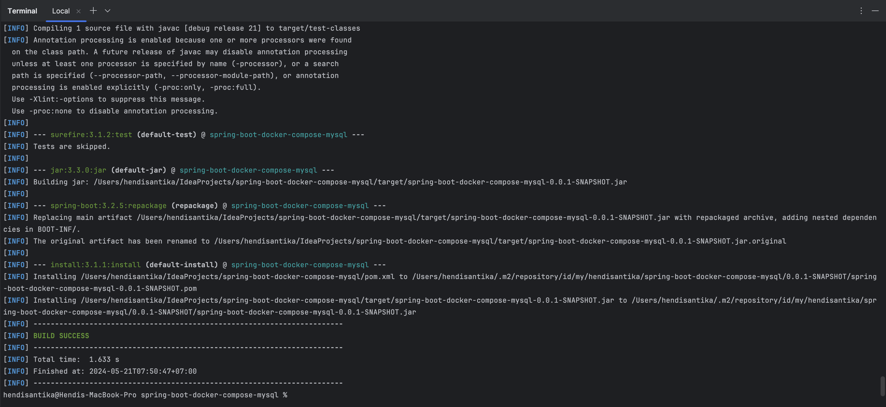
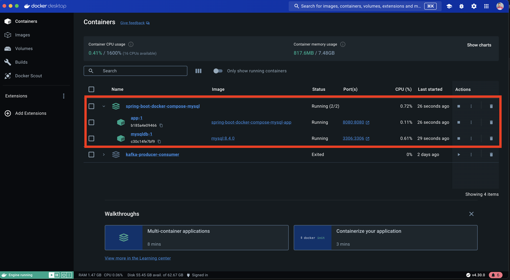
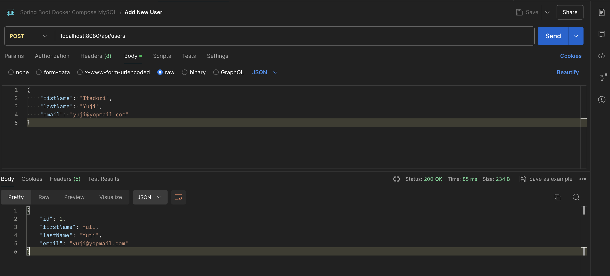
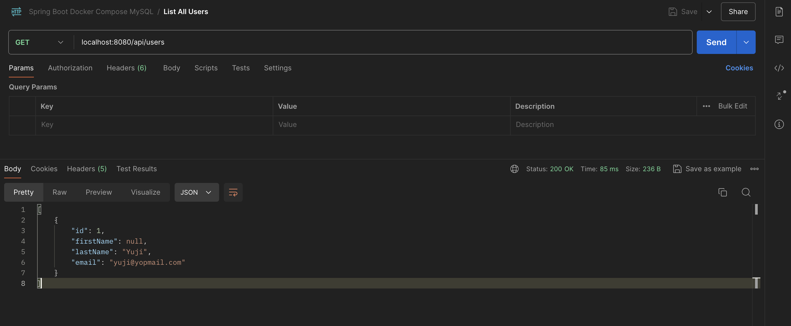
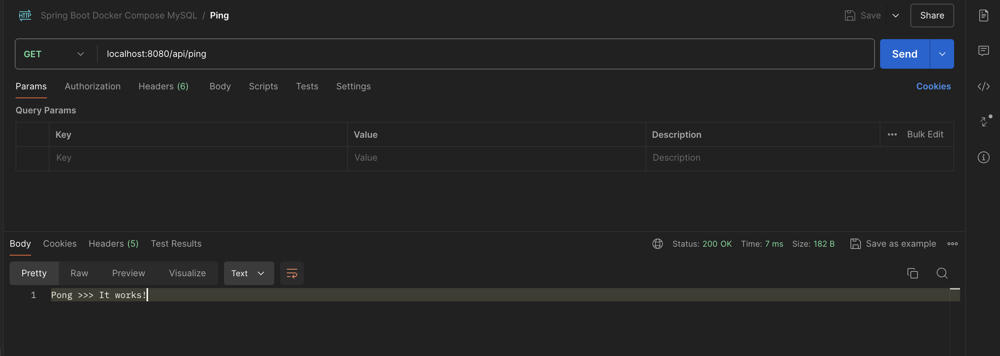

# Dockerize Spring Boot and MySQL with Docker Compose

### Introduction

Docker has revolutionized application deployment by enabling developers to package applications and their dependencies
into portable containers. In this comprehensive guide, we'll explore how to dockerize a Spring Boot application with
MySQL,
leveraging the power of Docker and Docker Compose. By containerizing your Spring Boot application, you can achieve easy
deployment,
improved portability, scalability, and version control.

# What is Docker?

**Docker** is an open-source platform that simplifies application deployment by packaging applications and their
dependencies into containers. Containers provide a lightweight, isolated environment that can run consistently across
different environments which greatly improves the development and deployment experiences.

## Why Dockerize a Spring Boot Application with MySQL?

Dockerizing a Spring Boot application with MySQL offers several advantages:

- **Portability**: Docker containers can be deployed on any machine running Docker, eliminating environment-specific
  issues.
- **Isolation**: Containers provide an isolated environment, ensuring consistent and reliable application execution.
- **Scalability**: Docker containers can be easily scaled horizontally to handle increased demand.
- **Versioning**: Docker images can be versioned, enabling easy management and rollback to previous application
  versions.

## Prerequisites

To follow this guide, ensure you have the following prerequisites:

- Docker installed on your machine, [this guide](https://docs.docker.com/get-docker/) could help.
- Java Development Kit (JDK) 21 installed, recent versions could work.
- Maven or Gradle build tool installed.

## Create a Spring Boot Application

Before proceeding, let's create a basic Spring Boot App with the latest stable release at the time of writing, which is
version **3.1.2**.

It involves accessing the initializer service at [https://start.spring.io](https://start.spring.io/), providing some
basic details in regard to the App, selecting the required dependencies then hitting on the **GENERATE** button to have
the basic structure of the project as follows:


You can quickly determine the following dependencies that come packaged in the **Maven** project:

- **Spring Data JPA**: Persist data in SQL stores with Java Persistence API using Spring Data and Hibernate.
- **Spring Web**: Build web, including RESTful, applications using Spring MVC. Uses Apache Tomcat as the default
  embedded container.
- **MySQL Driver**: MySQL JDBC driver.

Open the generated project in your favorite IDE or editor (I'm mainly using IntelliJ IDEA and VsCode), from there you
can tweak it a bit to have some entities, controllers, and business logic.

Hosted on GitHub, here's the [source code](https://github.com/hendisantika/spring-boot-docker-compose-mysql) of the
Spring Boot application that we'll be using to set up Docker along with a MySQL database.

The **application.properties** file holds some App configurations, it's not uncommon to see sensitive credentials in it,
here's its content:

```
# Server port
server.port=8080

# Datasource connection
spring.datasource.platform=mysql
spring.datasource.initialization-mode=always
spring.jpa.properties.hibernate.dialect=org.hibernate.dialect.MySQLDialect

# Hibernate
spring.jpa.hibernate.ddl-auto=update
spring.jpa.hibernate.show-sql=true

# Logging
logging.level.org.springframework=ERROR
logging.level.com.numericaideas=DEBUG
logging.level.org.hibernate.SQL=DEBUG
logging.level.org.hibernate.type.descriptor.sql.BasicBinder=TRACE
```

Let's build the App to make sure it compiles as expected, the following command must be run from the project root
folder:

```
./mvnw clean install -DskipTests
```

At the end of the execution, the **Maven** build output should look like this:



Other **Bash** scripts are available within the project for convenience:

- `build.sh`: to build the project.
- `up.sh`: to start the project using **Docker Compose**.
- `down.sh`: to shut everything down.

For our demo, the port in use is **8090** and we have implemented the CRUD operations for the **User** entity as well as
a **Ping** endpoint, we won't go deeper on that since it's out of scope and you can follow the next sections of this
guide with an existing Spring Boot (Maven) project too.

## Create Docker Image for Spring Boot Application

The `Dockerfile` should be provided to build an image of the Spring Boot Application, it contains the following lines:

```
# Use a base image with Java 21
FROM bellsoft/liberica-openjdk-debian:21
LABEL authors="hendisantika"

# Copy the JAR package into the image
ARG JAR_FILE=target/*.jar
COPY ${JAR_FILE} app.jar

# Expose the application port
EXPOSE 8080

# Run the App
ENTRYPOINT ["java", "-jar", "/app.jar"]
```

It's straightforward, the `Dockerfile` uses an image based on **Java 17**, it copies into the image the executable **JAR
** file that resulted from the build in the previous step, exposes the **port** the App is running on, then provides the
**entry point** which is the bash command to run at the end to start the container.

By building your image with the command `docker build .`, a successful output should be similar to the next image:



By this stage, we have the App image and since we'll use an official MySQL Docker image, we can manually spin up both
components and link them together by using the database credentials to run the App, but to make the process easier we'll
link their deployments together by using **Docker Compose** in the next section.

## Docker Compose Spring Boot and MySQL

Docker Compose simplifies the orchestration of multi-container applications. Create a file named `docker-compose.yml` in
your project directory and add the following configuration:

```yaml
services:
  app:
    build:
      context: .
      dockerfile: Dockerfile
    ports:
      - "8080:8080"
    depends_on:
      mysqldb:
        condition: service_healthy
    environment:
      - SPRING_DATASOURCE_URL=jdbc:mysql://mysqldb:3306/${MYSQL_DATABASE}
      - SPRING_DATASOURCE_USERNAME=root
      - SPRING_DATASOURCE_PASSWORD=${MYSQL_PASSWORD}
    networks:
      - springboot-mysql-network
  mysqldb:
    image: mysql:8.4.0
    ports:
      - "3306:3306"
    environment:
      - MYSQL_DATABASE=${MYSQL_DATABASE}
      - MYSQL_ROOT_PASSWORD=${MYSQL_PASSWORD}
    volumes:
      - ./mysql-data:/var/lib/mysql
    networks:
      - springboot-mysql-network
    healthcheck:
      test: [ "CMD", "mysqladmin" ,"ping", "-h", "localhost" ]
      retries: 10
      interval: 3s
      timeout: 30s
volumes:
  mysql-data:
networks:
  springboot-mysql-network:
    name: springboot-mysql-network
```

This Docker Compose configuration defines two services: `app` for the **Spring Boot Application** and `mysqldb` for the
**MySQL database**. The `app` service builds the image based on the [Dockerfile](./Dockerfile) in the project's root
directory. The `mysqldb` service uses the official **MySQL** image and sets the environment variables for the database
configuration. The `depends_on` attribute ensures that the Spring Boot application starts after the MySQL database in
order to guarantee dependency ordering. Finally, the `healthcheck` makes sure the MySQL service is ready to accept
connections before running the App.

For the App to connect itself to the MySQL database, as an enhanced security measure, we provided the database
credentials as environment variables via the services' environment attributes so these are textually hidden from the
project source code:

- **MYSQL_DATABASE**: The database name.
- **MYSQL_PASSWORD**: The database root's password, we use the root user account for simplicity only.

The environment attributes present in the **app** service are provided as environment variables to the App container at
run time, we are talking about:

- SPRING_DATASOURCE_URL
- SPRING_DATASOURCE_USERNAME
- SPRING_DATASOURCE_PASSWORD

Spring Boot automatically assigns these variables to the related **application.properties** configurations listed below:

- spring.datasource.url
- spring.datasource.username
- spring.datasource.password

Meaning we don't have to provide these manually into the **application.properties**
file, [read more here](https://docs.spring.io/spring-cloud-skipper/docs/1.0.0.BUILD-SNAPSHOT/reference/html/skipper-database-configuration.html).

## Run the Dockerized Application

To run the App via **Docker Compose**, open a terminal, navigate to the project's root directory, and execute the
following command in which we provide the **environment variables** directly:

```bash
MYSQL_DATABASE=userDB MYSQL_PASSWORD=S3cret docker-compose up
```

In case you would like to provide the environment variables from a hidden `.env` file, feel free to create it from
the `.env.sample` file and put it close to the `docker-compose.yml` within the project.

This being done, the command to run will change a bit to the following:

```bash
docker-compose up
```

Docker Compose will build the Spring Boot and MySQL images, create the containers, and start them. You'll see logs from
both the application and the database. To stop the containers, press Ctrl+C.

Using **Docker Desktop** enables you to view a nice summary of your Docker state in which we can see our running
containers as illustrated below:


The complete source code of the project is available
on [GitHub](https://github.com/hendisantika/spring-boot-docker-compose-mysql).

Open POSTMAN and **create** a POST request to the URL `localhost:8080/api/users` with a random user object to be
persisted in the DB:



Let's **list all users** which includes the one we just created:



A **ping** endpoint is also available:



———————

We have just started our journey to build a network of professionals to grow even more our free knowledge-sharing
community that’ll give you a chance to learn interesting things about topics like cloud computing, software development,
and software architectures while keeping the door open to more opportunities.

Does this speak to you? If **YES**, feel free to [Join our Discord Server](https://discord.gg/Th7NbXUN) to stay in touch
with the community and be part of independently organized events.

———————
